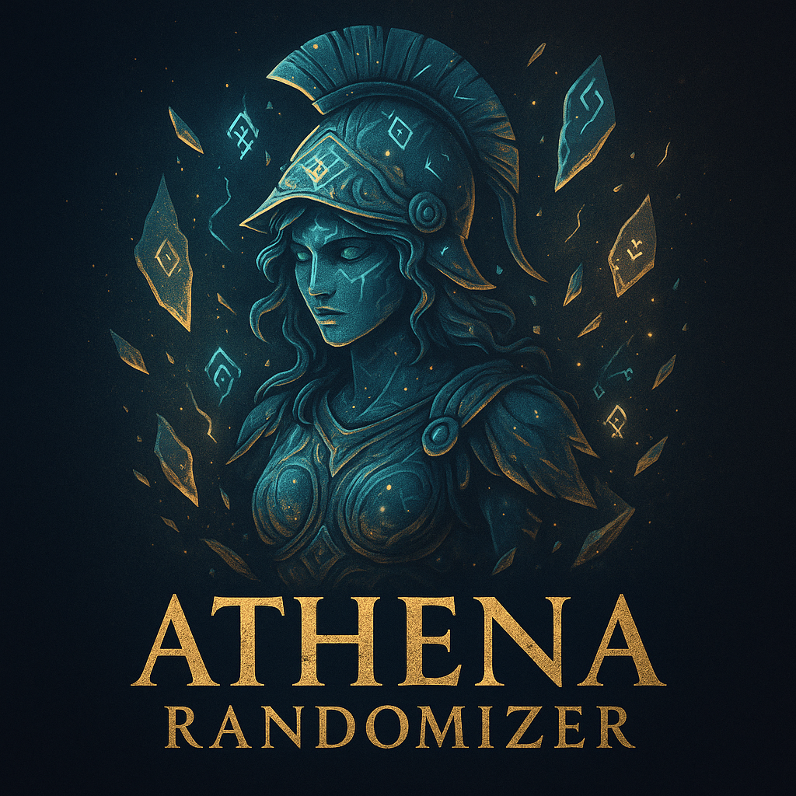

  

## 🏛️ Lore Description
> ATHENA RANDOMIZER — She Who Shuffles the Battlefield
>
> In the lands between fate and fire, the goddess Athena presides not only over war and wisdom—but also over chaos by design. In her divine cunning, she weaves uncertainty into the realm of strategy, scattering spells, incantations, and weapons across the map as offerings to those who would challenge her domain.
>
> Those who compete in the trials of Elden Ring bingo enter a battlefield touched by her hand—where no two journeys are the same, and foresight bends to fortune. The Athena Randomizer is not mere madness; it is the trial of intellect, adaptability, and courage.
>
> In every match, she watches—guiding none, favoring none, but ever demanding mastery of the unexpected.

---

## ⚔️ The Athena Randomizer

**The Athena Randomizer** is a powerful modular Elden Ring item and equipment randomizer tailored for competitive bingo matches. Taking inspiration from the goddess of wisdom and war, Athena reshapes the battlefield with divine unpredictability—reallocating weapons, shields, armor, and tools in ways that challenge even the most seasoned Tarnished.

---

## 🌐 Domains of Chaos

Athena’s influence is currently divided into three distinct domains:

| Domain             | Status              | Description |
|--------------------|---------------------|-------------|
| **Base Game**      | ✅ Alpha Available   | Full randomizer for the base game of Elden Ring |
| **Base Game + DLC**| 🛠️ Under Construction | Unified experience randomizing all content, meant for 2v2 matches |
| **DLC**            | ✅ Alpha Available   | Active domain used in SCADUBINGO DLC competitive league |

---

## 🌿 Base Game Mode: Overview

The **Base Game mode** introduces chaos to the familiar routes of Limgrave, Liurnia, and beyond.

Features include:

- 🧠 **Uniformly-distributed randomization** of weapons, sorceries, incantations, shops, and remembrance rewards
- ⚗️ **Perfume Bottles** now join the chaotic item pool
- 🗺️ **All map fragments** are granted at the start of your journey
- 🕯️ **Lantern** is also provided from the beginning
- 🌅 **Grace near Varre’s church** added to ease the Mohg questline
- 🪨 **Smithing stones** cost 2 per level — balanced and predictable
- 💧 **Flask upgrade confirmations** removed for faster flow

This domain supports seed-based determinism for consistent races, practice, and match-based scenarios.

---

## 🎮 DLC Mode: Overview

The **DLC mode** is under **active alpha development**. Despite its early stage, it is **continually battle-tested and used by the SCADUBINGO community** to host competitive randomized Elden Ring DLC bingo matches.

The DLC mode includes:

- 🎲 **Seeded determinism**: Players can share a base seed to reproduce identical game worlds
- 🏹 **Weapon pool logic**: Randomizes pools separately: bows and crossbows, shields, perfume bottles, and more
- 🛍️ **Millicent’s shop reshuffling**: Merchant Millicent awaits you at the Gravesite Hollow, the entrance to the DLC, with new shop dynamics
- 🐴 **Horse blinders for Torrent**: Traipse through the Abyssal Woods atop your trusty steed
- 🛡️ **Randomized Armor Sets**: Millicent sells one of 9 drip sets, protection secondary

---

## 🔐 Licensing

SPDX-License-Identifier: GPL-3.0-only

---

## 🏹 Used in:

- The Ignite discord community: [join now for Elden Ring & Nightreign gaming!](https://discord.gg/ignitesouls)
- **SCADUBINGO: DLC Bingo**

---

## 📣 Contributing

Want to help shape the battlefield? Join the discord and contact a @firekeeper.

Let the goddess guide your chaos.
